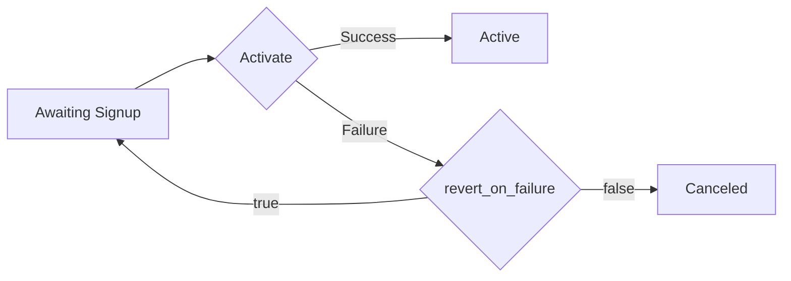

# Subscriptions

```php
$subscriptionsController = $client->getSubscriptionsController();
```

## Class Name

`SubscriptionsController`

## Methods

* [Create Subscription](../../doc/controllers/subscriptions.md#create-subscription)
* [List Subscriptions](../../doc/controllers/subscriptions.md#list-subscriptions)
* [Update Subscription](../../doc/controllers/subscriptions.md#update-subscription)
* [Read Subscription](../../doc/controllers/subscriptions.md#read-subscription)
* [Override Subscription](../../doc/controllers/subscriptions.md#override-subscription)
* [Find Subscription](../../doc/controllers/subscriptions.md#find-subscription)
* [Purge Subscription](../../doc/controllers/subscriptions.md#purge-subscription)
* [Update Prepaid Subscription Configuration](../../doc/controllers/subscriptions.md#update-prepaid-subscription-configuration)
* [Preview Subscription](../../doc/controllers/subscriptions.md#preview-subscription)
* [Apply Coupons to Subscription](../../doc/controllers/subscriptions.md#apply-coupons-to-subscription)
* [Remove Coupon From Subscription](../../doc/controllers/subscriptions.md#remove-coupon-from-subscription)
* [Activate Subscription](../../doc/controllers/subscriptions.md#activate-subscription)


# Create Subscription

Creates a Subscription for a customer and product

Specify the product with `product_id` or `product_handle`. To set a specific product pricepPoint, use `product_price_point_handle` or `product_price_point_id`.

Identify an existing customer with `customer_id` or `customer_reference`. Optionally, include an existing payment profile using `payment_profile_id`. To create a new customer, pass customer_attributes.

Select an option from the **Request Examples** drop-down on the right side of the portal to see examples of common scenarios for creating subscriptions.

Payment information may be required to create a subscription, depending on the options for the Product being subscribed. See [product options](https://docs.maxio.com/hc/en-us/articles/24261076617869-Edit-Products) for more information. See the [Payments Profile](../../doc/controllers/payment-profiles.md#create-payment-profile) endpoint for details on payment parameters.

Do not use real card information for testing. See the Sites articles that cover [testing your site setup](https://docs.maxio.com/hc/en-us/articles/24250712113165-Testing-Overview#testing-overview-0-0) for more details on testing in your sandbox.

Note that collecting and sending raw card details in production requires [PCI compliance](https://docs.maxio.com/hc/en-us/articles/24183956938381-PCI-Compliance#pci-compliance-0-0) on your end. If your business is not PCI compliant, use [Chargify.js](https://docs.maxio.com/hc/en-us/articles/38163190843789-Chargify-js-Overview#chargify-js-overview-0-0) to collect credit card or bank account information.

See the [Subscription Signups](page:introduction/basic-concepts/subscription-signup) article for more information on working with subscriptions in Advanced Billing.

```php
function createSubscription(?CreateSubscriptionRequest $body = null): SubscriptionResponse
```

## Parameters

| Parameter | Type | Tags | Description |
|  --- | --- | --- | --- |
| `body` | [`?CreateSubscriptionRequest`](../../doc/models/create-subscription-request.md) | Body, Optional | - |

## Response Type

[`SubscriptionResponse`](../../doc/models/subscription-response.md)

## Example Usage

```php
$body = CreateSubscriptionRequestBuilder::init(
    CreateSubscriptionBuilder::init()
        ->productHandle('basic')
        ->paymentCollectionMethod(CollectionMethod::REMITTANCE)
        ->customerAttributes(
            CustomerAttributesBuilder::init()
                ->firstName('Joe')
                ->lastName('Smith')
                ->email('joe@example.com')
                ->organization('Acme')
                ->reference('XYZ')
                ->address('123 Mass Ave.')
                ->address2('address_24')
                ->city('Boston')
                ->state('MA')
                ->zip('02120')
                ->country('US')
                ->phone('(617) 111 - 0000')
                ->build()
        )
        ->build()
)->build();

$result = $subscriptionsController->createSubscription($body);
```

## Example Response *(as JSON)*

```json
{
  "subscription": {
    "id": 15236915,
    "state": "active",
    "balance_in_cents": 0,
    "total_revenue_in_cents": 14000,
    "product_price_in_cents": 1000,
    "product_version_number": 7,
    "current_period_ends_at": "2016-11-15T14:48:10-05:00",
    "next_assessment_at": "2016-11-15T14:48:10-05:00",
    "trial_started_at": null,
    "trial_ended_at": null,
    "activated_at": "2016-11-14T14:48:12-05:00",
    "expires_at": null,
    "created_at": "2016-11-14T14:48:10-05:00",
    "updated_at": "2016-11-14T15:24:41-05:00",
    "cancellation_message": null,
    "cancellation_method": "merchant_api",
    "cancel_at_end_of_period": null,
    "canceled_at": null,
    "current_period_started_at": "2016-11-14T14:48:10-05:00",
    "previous_state": "active",
    "signup_payment_id": 162269766,
    "signup_revenue": "260.00",
    "delayed_cancel_at": null,
    "coupon_code": "5SNN6HFK3GBH",
    "payment_collection_method": "automatic",
    "snap_day": null,
    "reason_code": null,
    "receives_invoice_emails": false,
    "customer": {
      "first_name": "Curtis",
      "last_name": "Test",
      "email": "curtis@example.com",
      "cc_emails": "jeff@example.com",
      "organization": "",
      "reference": null,
      "id": 14714298,
      "created_at": "2016-11-14T14:48:10-05:00",
      "updated_at": "2016-11-14T14:48:13-05:00",
      "address": "123 Anywhere Street",
      "address_2": "",
      "city": "Boulder",
      "state": "CO",
      "zip": "80302",
      "country": "US",
      "phone": "",
      "verified": false,
      "portal_customer_created_at": "2016-11-14T14:48:13-05:00",
      "portal_invite_last_sent_at": "2016-11-14T14:48:13-05:00",
      "portal_invite_last_accepted_at": null,
      "tax_exempt": false,
      "vat_number": "012345678"
    },
    "product": {
      "id": 3792003,
      "name": "$10 Basic Plan",
      "handle": "basic",
      "description": "lorem ipsum",
      "accounting_code": "basic",
      "price_in_cents": 1000,
      "interval": 1,
      "interval_unit": "day",
      "initial_charge_in_cents": null,
      "expiration_interval": null,
      "expiration_interval_unit": "never",
      "trial_price_in_cents": null,
      "trial_interval": null,
      "trial_interval_unit": "month",
      "initial_charge_after_trial": false,
      "return_params": "",
      "request_credit_card": false,
      "require_credit_card": false,
      "created_at": "2016-03-24T13:38:39-04:00",
      "updated_at": "2016-11-03T13:03:05-04:00",
      "archived_at": null,
      "update_return_url": "",
      "update_return_params": "",
      "product_family": {
        "id": 527890,
        "name": "Acme Projects",
        "handle": "billing-plans",
        "accounting_code": null,
        "description": ""
      },
      "public_signup_pages": [
        {
          "id": 281054,
          "url": "https://general-goods.chargify.com/subscribe/kqvmfrbgd89q/basic"
        },
        {
          "id": 281240,
          "url": "https://general-goods.chargify.com/subscribe/dkffht5dxfd8/basic"
        },
        {
          "id": 282694,
          "url": "https://general-goods.chargify.com/subscribe/jwffwgdd95s8/basic"
        }
      ],
      "taxable": false,
      "version_number": 7,
      "product_price_point_name": "Default"
    },
    "credit_card": {
      "id": 10191713,
      "payment_type": "credit_card",
      "first_name": "Curtis",
      "last_name": "Test",
      "masked_card_number": "XXXX-XXXX-XXXX-1",
      "card_type": "bogus",
      "expiration_month": 1,
      "expiration_year": 2026,
      "billing_address": "123 Anywhere Street",
      "billing_address_2": "",
      "billing_city": "Boulder",
      "billing_state": null,
      "billing_country": "",
      "billing_zip": "80302",
      "current_vault": "bogus",
      "vault_token": "1",
      "customer_vault_token": null,
      "customer_id": 14714298
    },
    "payment_type": "credit_card",
    "referral_code": "w7kjc9",
    "next_product_id": null,
    "coupon_use_count": 1,
    "coupon_uses_allowed": 1,
    "next_product_handle": null,
    "stored_credential_transaction_id": 125566112256688,
    "dunning_communication_delay_enabled": true,
    "dunning_communication_delay_time_zone": "Eastern Time (US & Canada)"
  }
}
```

## Errors

| HTTP Status Code | Error Description | Exception Class |
|  --- | --- | --- |
| 422 | Unprocessable Entity (WebDAV) | [`ErrorListResponseException`](../../doc/models/error-list-response-exception.md) |


# List Subscriptions

This method will return an array of subscriptions from a Site. Pay close attention to query string filters and pagination in order to control responses from the server.

## Search for a subscription

Use the query strings below to search for a subscription using the criteria available. The return value will be an array.

## Self-Service Page token

Self-Service Page token for the subscriptions is not returned by default. If this information is desired, the include[]=self_service_page_token parameter must be provided with the request.

```php
function listSubscriptions(array $options): array
```

## Parameters

| Parameter | Type | Tags | Description |
|  --- | --- | --- | --- |
| `page` | `?int` | Query, Optional | Result records are organized in pages. By default, the first page of results is displayed. The page parameter specifies a page number of results to fetch. You can start navigating through the pages to consume the results. You do this by passing in a page parameter. Retrieve the next page by adding ?page=2 to the query string. If there are no results to return, then an empty result set will be returned.<br>Use in query `page=1`.<br><br>**Default**: `1`<br><br>**Constraints**: `>= 1` |
| `perPage` | `?int` | Query, Optional | This parameter indicates how many records to fetch in each request. Default value is 20. The maximum allowed values is 200; any per_page value over 200 will be changed to 200.<br>Use in query `per_page=200`.<br><br>**Default**: `20`<br><br>**Constraints**: `<= 200` |
| `state` | [`?string(SubscriptionStateFilter)`](../../doc/models/subscription-state-filter.md) | Query, Optional | The current state of the subscription |
| `product` | `?int` | Query, Optional | The product id of the subscription. (Note that the product handle cannot be used.) |
| `productPricePointId` | `?int` | Query, Optional | The ID of the product price point. If supplied, product is required |
| `coupon` | `?int` | Query, Optional | The numeric id of the coupon currently applied to the subscription. (This can be found in the URL when editing a coupon. Note that the coupon code cannot be used.) |
| `couponCode` | `?string` | Query, Optional | The coupon code currently applied to the subscription |
| `dateField` | [`?string(SubscriptionDateField)`](../../doc/models/subscription-date-field.md) | Query, Optional | The type of filter you'd like to apply to your search.  Allowed Values: , current_period_ends_at, current_period_starts_at, created_at, activated_at, canceled_at, expires_at, trial_started_at, trial_ended_at, updated_at |
| `startDate` | `?DateTime` | Query, Optional | The start date (format YYYY-MM-DD) with which to filter the date_field. Returns subscriptions with a timestamp at or after midnight (12:00:00 AM) in your site’s time zone on the date specified. Use in query `start_date=2022-07-01`. |
| `endDate` | `?DateTime` | Query, Optional | The end date (format YYYY-MM-DD) with which to filter the date_field. Returns subscriptions with a timestamp up to and including 11:59:59PM in your site’s time zone on the date specified. Use in query `end_date=2022-08-01`. |
| `startDatetime` | `?DateTime` | Query, Optional | The start date and time (format YYYY-MM-DD HH:MM:SS) with which to filter the date_field. Returns subscriptions with a timestamp at or after exact time provided in query. You can specify timezone in query - otherwise your site's time zone will be used. If provided, this parameter will be used instead of start_date. Use in query `start_datetime=2022-07-01 09:00:05`. |
| `endDatetime` | `?DateTime` | Query, Optional | The end date and time (format YYYY-MM-DD HH:MM:SS) with which to filter the date_field. Returns subscriptions with a timestamp at or before exact time provided in query. You can specify timezone in query - otherwise your site's time zone will be used. If provided, this parameter will be used instead of end_date. Use in query `end_datetime=2022-08-01 10:00:05`. |
| `metadata` | `?array<string,string>` | Query, Optional | The value of the metadata field specified in the parameter. Use in query `metadata[my-field]=value&metadata[other-field]=another_value`. |
| `direction` | [`?string(SortingDirection)`](../../doc/models/sorting-direction.md) | Query, Optional | Controls the order in which results are returned.<br>Use in query `direction=asc`. |
| `sort` | [`?string(SubscriptionSort)`](../../doc/models/subscription-sort.md) | Query, Optional | The attribute by which to sort<br><br>**Default**: `SubscriptionSort::SIGNUP_DATE` |
| `mInclude` | [`?(string(SubscriptionListInclude)[])`](../../doc/models/subscription-list-include.md) | Query, Optional | Allows including additional data in the response. Use in query: `include[]=self_service_page_token`. |

## Response Type

[`SubscriptionResponse[]`](../../doc/models/subscription-response.md)

## Example Usage

```php
$collect = [
    'page' => 1,
    'perPage' => 50,
    'startDate' => DateTimeHelper::fromSimpleDate('2022-07-01'),
    'endDate' => DateTimeHelper::fromSimpleDate('2022-08-01'),
    'startDatetime' => DateTimeHelper::fromRfc3339DateTime('2022-07-01 09:00:05'),
    'endDatetime' => DateTimeHelper::fromRfc3339DateTime('2022-08-01 10:00:05'),
    'sort' => SubscriptionSort::SIGNUP_DATE,
    'mInclude' => [
        SubscriptionListInclude::SELF_SERVICE_PAGE_TOKEN
    ]
];

$result = $subscriptionsController->listSubscriptions($collect);
```


# Update Subscription

Updates one or more attributes of a subscription.

## Update Subscription Payment Method

Change the card that your subscriber uses for their subscription. You can also use this method to change the expiration date of the card **if your gateway allows**.

Do not use real card information for testing. See the Sites articles that cover [testing your site setup](https://docs.maxio.com/hc/en-us/articles/24250712113165-Testing-Overview#testing-overview-0-0) for more details on testing in your sandbox.

Note that collecting and sending raw card details in production requires [PCI compliance](https://docs.maxio.com/hc/en-us/articles/24183956938381-PCI-Compliance#pci-compliance-0-0) on your end. If your business is not PCI compliant, use [Chargify.js](https://docs.maxio.com/hc/en-us/articles/38163190843789-Chargify-js-Overview#chargify-js-overview-0-0) to collect credit card or bank account information.

> Note: Partial card updates for **Authorize.Net** are not allowed via this endpoint. The existing Payment Profile must be directly updated instead.

## Update Product

You also use this method to change the subscription to a different product by setting a new value for product_handle. A product change can be done in two different ways, **product change** or **delayed product change**.

### Product Change

You can change a subscription's product. The new payment amount is calculated and charged at the normal start of the next period. If you require complex product changes or prorated upgrades and downgrades instead, please see the documentation on [Migrating Subscription Products](https://docs.maxio.com/hc/en-us/articles/24252069837581-Product-Changes-and-Migrations#product-changes-and-migrations-0-0).

To perform a product change, set either the `product_handle` or `product_id` attribute to that of a different product from the same site as the subscription. You can also change the price point by passing in either `product_price_point_id` or `product_price_point_handle` - otherwise the new product's default price point is used.

### Delayed Product Change

This method also changes the product and/or price point, and the new payment amount is calculated and charged at the normal start of the next period.

This method schedules the product change to happen automatically at the subscription’s next renewal date. To perform a delayed product change, set the `product_handle` attribute as you would in a regular product change, but also set the `product_change_delayed` attribute to `true`. No proration applies in this case.

You can also perform a delayed change to the price point by passing in either `product_price_point_id` or `product_price_point_handle`

> **Note:** To cancel a delayed product change, set `next_product_id` to an empty string.

## Billing Date Changes

You can update dates for a subscrption.

### Regular Billing Date Changes

Send the `next_billing_at` to set the next billing date for the subscription. After that date passes and the subscription is processed, the following billing date will be set according to the subscription's product period.

> Note: If you pass an invalid date, the correct date is automatically set to he correct date. For example, if February 30 is passed, the next billing would be set to March 2nd in a non-leap year.

The server response will not return data under the key/value pair of `next_billing_at`. View the key/value pair of `current_period_ends_at` to verify that the `next_billing_at` date has been changed successfully.

### Calendar Billing  and Snap Day Changes

For a subscription using Calendar Billing, setting the next billing date is a bit different. Send the `snap_day` attribute to change the calendar billing date for **a subscription using a product eligible for calendar billing**.

> Note: If you change the product associated with a subscription that contains a `snap_day` and immediately `READ/GET` the subscription data, it will still contain original `snap_day`. The `snap_day`will will reset to 'null on the next billing cycle. This is because  a product change is instantanous and only affects the product associated with a subscription.

```php
function updateSubscription(int $subscriptionId, ?UpdateSubscriptionRequest $body = null): SubscriptionResponse
```

## Parameters

| Parameter | Type | Tags | Description |
|  --- | --- | --- | --- |
| `subscriptionId` | `int` | Template, Required | The Chargify id of the subscription |
| `body` | [`?UpdateSubscriptionRequest`](../../doc/models/update-subscription-request.md) | Body, Optional | - |

## Response Type

[`SubscriptionResponse`](../../doc/models/subscription-response.md)

## Example Usage

```php
$subscriptionId = 222;

$body = UpdateSubscriptionRequestBuilder::init(
    UpdateSubscriptionBuilder::init()
        ->nextBillingAt(DateTimeHelper::fromRfc3339DateTime('2010-08-06T15:34:00Z'))
        ->paymentCollectionMethod('remittance')
        ->build()
)->build();

$result = $subscriptionsController->updateSubscription(
    $subscriptionId,
    $body
);
```

## Example Response *(as JSON)*

```json
{
  "subscription": {
    "id": 18220670,
    "state": "active",
    "trial_started_at": null,
    "trial_ended_at": null,
    "activated_at": "2017-06-27T13:45:15-05:00",
    "created_at": "2017-06-27T13:45:13-05:00",
    "updated_at": "2017-06-30T09:26:50-05:00",
    "expires_at": null,
    "balance_in_cents": 10000,
    "current_period_ends_at": "2017-06-30T12:00:00-05:00",
    "next_assessment_at": "2017-06-30T12:00:00-05:00",
    "canceled_at": null,
    "cancellation_message": null,
    "next_product_id": null,
    "cancel_at_end_of_period": false,
    "payment_collection_method": "automatic",
    "snap_day": "end",
    "cancellation_method": null,
    "current_period_started_at": "2017-06-27T13:45:13-05:00",
    "previous_state": "active",
    "signup_payment_id": 191819284,
    "signup_revenue": "0.00",
    "delayed_cancel_at": null,
    "coupon_code": null,
    "total_revenue_in_cents": 0,
    "product_price_in_cents": 0,
    "product_version_number": 1,
    "payment_type": null,
    "referral_code": "d3pw7f",
    "coupon_use_count": null,
    "coupon_uses_allowed": null,
    "reason_code": null,
    "automatically_resume_at": null,
    "current_billing_amount_in_cents": 10000,
    "receives_invoice_emails": false,
    "customer": {
      "id": 17780587,
      "first_name": "Catie",
      "last_name": "Test",
      "organization": "Acme, Inc.",
      "email": "catie@example.com",
      "created_at": "2017-06-27T13:01:05-05:00",
      "updated_at": "2017-06-30T09:23:10-05:00",
      "reference": "123ABC",
      "address": "123 Anywhere Street",
      "address_2": "Apartment #10",
      "city": "Los Angeles",
      "state": "CA",
      "zip": "90210",
      "country": "US",
      "phone": "555-555-5555",
      "portal_invite_last_sent_at": "2017-06-27T13:45:16-05:00",
      "portal_invite_last_accepted_at": null,
      "verified": true,
      "portal_customer_created_at": "2017-06-27T13:01:08-05:00",
      "cc_emails": "support@example.com",
      "tax_exempt": true
    },
    "product": {
      "id": 4470347,
      "name": "Zero Dollar Product",
      "handle": "zero-dollar-product",
      "description": "",
      "accounting_code": "",
      "request_credit_card": true,
      "expiration_interval": null,
      "expiration_interval_unit": "never",
      "created_at": "2017-03-23T10:54:12-05:00",
      "updated_at": "2017-04-20T15:18:46-05:00",
      "price_in_cents": 0,
      "interval": 1,
      "interval_unit": "month",
      "initial_charge_in_cents": null,
      "trial_price_in_cents": null,
      "trial_interval": null,
      "trial_interval_unit": "month",
      "archived_at": null,
      "require_credit_card": false,
      "return_params": "",
      "taxable": false,
      "update_return_url": "",
      "tax_code": "",
      "initial_charge_after_trial": false,
      "version_number": 1,
      "update_return_params": "",
      "product_family": {
        "id": 997233,
        "name": "Acme Products",
        "description": "",
        "handle": "acme-products",
        "accounting_code": null
      },
      "public_signup_pages": [
        {
          "id": 316810,
          "return_url": "",
          "return_params": "",
          "url": "https://general-goods.chargify.com/subscribe/69x825m78v3d/zero-dollar-product"
        }
      ]
    }
  }
}
```

## Errors

| HTTP Status Code | Error Description | Exception Class |
|  --- | --- | --- |
| 422 | Unprocessable Entity (WebDAV) | [`ErrorListResponseException`](../../doc/models/error-list-response-exception.md) |


# Read Subscription

Use this endpoint to find subscription details.

## Self-Service Page token

Self-Service Page token for the subscription is not returned by default. If this information is desired, the include[]=self_service_page_token parameter must be provided with the request.

```php
function readSubscription(int $subscriptionId, ?array $mInclude = null): SubscriptionResponse
```

## Parameters

| Parameter | Type | Tags | Description |
|  --- | --- | --- | --- |
| `subscriptionId` | `int` | Template, Required | The Chargify id of the subscription |
| `mInclude` | [`?(string(SubscriptionInclude)[])`](../../doc/models/subscription-include.md) | Query, Optional | Allows including additional data in the response. Use in query: `include[]=coupons&include[]=self_service_page_token`. |

## Response Type

[`SubscriptionResponse`](../../doc/models/subscription-response.md)

## Example Usage

```php
$subscriptionId = 222;

$include = [
    SubscriptionInclude::COUPONS,
    SubscriptionInclude::SELF_SERVICE_PAGE_TOKEN
];

$result = $subscriptionsController->readSubscription(
    $subscriptionId,
    $include
);
```

## Example Response *(as JSON)*

```json
{
  "subscription": {
    "id": 15236915,
    "state": "active",
    "balance_in_cents": 0,
    "total_revenue_in_cents": 14000,
    "product_price_in_cents": 1000,
    "product_version_number": 7,
    "current_period_ends_at": "2016-11-15T14:48:10-05:00",
    "next_assessment_at": "2016-11-15T14:48:10-05:00",
    "trial_started_at": null,
    "trial_ended_at": null,
    "activated_at": "2016-11-14T14:48:12-05:00",
    "expires_at": null,
    "created_at": "2016-11-14T14:48:10-05:00",
    "updated_at": "2016-11-14T15:24:41-05:00",
    "cancellation_message": null,
    "cancellation_method": null,
    "cancel_at_end_of_period": null,
    "canceled_at": null,
    "current_period_started_at": "2016-11-14T14:48:10-05:00",
    "previous_state": "active",
    "signup_payment_id": 162269766,
    "signup_revenue": "260.00",
    "delayed_cancel_at": null,
    "coupon_code": "5SNN6HFK3GBH",
    "payment_collection_method": "automatic",
    "snap_day": null,
    "reason_code": null,
    "receives_invoice_emails": false,
    "net_terms": 0,
    "customer": {
      "first_name": "Curtis",
      "last_name": "Test",
      "email": "curtis@example.com",
      "cc_emails": "jeff@example.com",
      "organization": "",
      "reference": null,
      "id": 14714298,
      "created_at": "2016-11-14T14:48:10-05:00",
      "updated_at": "2016-11-14T14:48:13-05:00",
      "address": "123 Anywhere Street",
      "address_2": "",
      "city": "Boulder",
      "state": "CO",
      "zip": "80302",
      "country": "US",
      "phone": "",
      "verified": false,
      "portal_customer_created_at": "2016-11-14T14:48:13-05:00",
      "portal_invite_last_sent_at": "2016-11-14T14:48:13-05:00",
      "portal_invite_last_accepted_at": null,
      "tax_exempt": false,
      "vat_number": "012345678"
    },
    "product": {
      "id": 3792003,
      "name": "$10 Basic Plan",
      "handle": "basic",
      "description": "lorem ipsum",
      "accounting_code": "basic",
      "price_in_cents": 1000,
      "interval": 1,
      "interval_unit": "day",
      "initial_charge_in_cents": null,
      "expiration_interval": null,
      "expiration_interval_unit": "never",
      "trial_price_in_cents": null,
      "trial_interval": null,
      "trial_interval_unit": "month",
      "initial_charge_after_trial": false,
      "return_params": "",
      "request_credit_card": false,
      "require_credit_card": false,
      "created_at": "2016-03-24T13:38:39-04:00",
      "updated_at": "2016-11-03T13:03:05-04:00",
      "archived_at": null,
      "update_return_url": "",
      "update_return_params": "",
      "product_family": {
        "id": 527890,
        "name": "Acme Projects",
        "handle": "billing-plans",
        "accounting_code": null,
        "description": ""
      },
      "public_signup_pages": [
        {
          "id": 281054,
          "url": "https://general-goods.chargify.com/subscribe/kqvmfrbgd89q/basic"
        },
        {
          "id": 281240,
          "url": "https://general-goods.chargify.com/subscribe/dkffht5dxfd8/basic"
        },
        {
          "id": 282694,
          "url": "https://general-goods.chargify.com/subscribe/jwffwgdd95s8/basic"
        }
      ],
      "taxable": false,
      "version_number": 7,
      "product_price_point_name": "Default"
    },
    "credit_card": {
      "id": 10191713,
      "payment_type": "credit_card",
      "first_name": "Curtis",
      "last_name": "Test",
      "masked_card_number": "XXXX-XXXX-XXXX-1",
      "card_type": "bogus",
      "expiration_month": 1,
      "expiration_year": 2026,
      "billing_address": "123 Anywhere Street",
      "billing_address_2": "",
      "billing_city": "Boulder",
      "billing_state": null,
      "billing_country": "",
      "billing_zip": "80302",
      "current_vault": "bogus",
      "vault_token": "1",
      "customer_vault_token": null,
      "customer_id": 14714298
    },
    "payment_type": "credit_card",
    "referral_code": "w7kjc9",
    "next_product_id": null,
    "coupon_use_count": 1,
    "coupon_uses_allowed": 1,
    "stored_credential_transaction_id": 166411599220288,
    "on_hold_at": null,
    "scheduled_cancellation_at": "2016-11-14T14:48:13-05:00"
  }
}
```


# Override Subscription

This API endpoint allows you to set certain subscription fields that are usually managed for you automatically. Some of the fields can be set via the normal Subscriptions Update API, but others can only be set using this endpoint.

This endpoint is provided for cases where you need to “align” Advanced Billing data with data that happened in your system, perhaps before you started using Advanced Billing. For example, you may choose to import your historical subscription data, and would like the activation and cancellation dates in Advanced Billing to match your existing historical dates. Advanced Billing does not backfill historical events (i.e. from the Events API), but some static data can be changed via this API.

Why are some fields only settable from this endpoint, and not the normal subscription create and update endpoints? Because we want users of this endpoint to be aware that these fields are usually managed by Advanced Billing, and using this API means **you are stepping out on your own.**

Changing these fields will not affect any other attributes. For example, adding an expiration date will not affect the next assessment date on the subscription.

If you regularly need to override the current_period_starts_at for new subscriptions, this can also be accomplished by setting both `previous_billing_at` and `next_billing_at` at subscription creation. See the documentation on [Importing Subscriptions](./b3A6MTQxMDgzODg-create-subscription#subscriptions-import) for more information.

## Limitations

When passing `current_period_starts_at` some validations are made:

1. The subscription needs to be unbilled (no statements or invoices).
2. The value passed must be a valid date/time. We recommend using the iso 8601 format.
3. The value passed must be before the current date/time.

If unpermitted parameters are sent, a 400 HTTP response is sent along with a string giving the reason for the problem.

```php
function overrideSubscription(int $subscriptionId, ?OverrideSubscriptionRequest $body = null): void
```

## Parameters

| Parameter | Type | Tags | Description |
|  --- | --- | --- | --- |
| `subscriptionId` | `int` | Template, Required | The Chargify id of the subscription |
| `body` | [`?OverrideSubscriptionRequest`](../../doc/models/override-subscription-request.md) | Body, Optional | Only these fields are available to be set. |

## Response Type

`void`

## Example Usage

```php
$subscriptionId = 222;

$body = OverrideSubscriptionRequestBuilder::init(
    OverrideSubscriptionBuilder::init()
        ->activatedAt(DateTimeHelper::fromRfc3339DateTime('1999-12-01T10:28:34-05:00'))
        ->canceledAt(DateTimeHelper::fromRfc3339DateTime('2000-12-31T10:28:34-05:00'))
        ->cancellationMessage('Original cancellation in 2000')
        ->expiresAt(DateTimeHelper::fromRfc3339DateTime('2001-07-15T10:28:34-05:00'))
        ->build()
)->build();

$subscriptionsController->overrideSubscription(
    $subscriptionId,
    $body
);
```

## Errors

| HTTP Status Code | Error Description | Exception Class |
|  --- | --- | --- |
| 422 | Unprocessable Entity (WebDAV) | [`SingleErrorResponseException`](../../doc/models/single-error-response-exception.md) |


# Find Subscription

Use this endpoint to find a subscription by its reference.

```php
function findSubscription(?string $reference = null): SubscriptionResponse
```

## Parameters

| Parameter | Type | Tags | Description |
|  --- | --- | --- | --- |
| `reference` | `?string` | Query, Optional | Subscription reference |

## Response Type

[`SubscriptionResponse`](../../doc/models/subscription-response.md)

## Example Usage

```php
$result = $subscriptionsController->findSubscription();
```

## Errors

| HTTP Status Code | Error Description | Exception Class |
|  --- | --- | --- |
| 404 | Not Found | `ApiException` |


# Purge Subscription

For sites in test mode, you may purge individual subscriptions.

Provide the subscription ID in the url.  To confirm, supply the customer ID in the query string `ack` parameter. You may also delete the customer record and/or payment profiles by passing `cascade` parameters. For example, to delete just the customer record, the query params would be: `?ack={customer_id}&cascade[]=customer`

If you need to remove subscriptions from a live site, contact support to discuss your use case.

### Delete customer and payment profile

The query params will be: `?ack={customer_id}&cascade[]=customer&cascade[]=payment_profile`

```php
function purgeSubscription(int $subscriptionId, int $ack, ?array $cascade = null): SubscriptionResponse
```

## Parameters

| Parameter | Type | Tags | Description |
|  --- | --- | --- | --- |
| `subscriptionId` | `int` | Template, Required | The Chargify id of the subscription |
| `ack` | `int` | Query, Required | id of the customer. |
| `cascade` | [`?(string(SubscriptionPurgeType)[])`](../../doc/models/subscription-purge-type.md) | Query, Optional | Options are "customer" or "payment_profile".<br>Use in query: `cascade[]=customer&cascade[]=payment_profile`. |

## Response Type

[`SubscriptionResponse`](../../doc/models/subscription-response.md)

## Example Usage

```php
$subscriptionId = 222;

$ack = 252;

$cascade = [
    SubscriptionPurgeType::CUSTOMER,
    SubscriptionPurgeType::PAYMENT_PROFILE
];

$result = $subscriptionsController->purgeSubscription(
    $subscriptionId,
    $ack,
    $cascade
);
```

## Errors

| HTTP Status Code | Error Description | Exception Class |
|  --- | --- | --- |
| 400 | Bad Request | [`SubscriptionResponseErrorException`](../../doc/models/subscription-response-error-exception.md) |


# Update Prepaid Subscription Configuration

Use this endpoint to update a subscription's prepaid configuration.

```php
function updatePrepaidSubscriptionConfiguration(
    int $subscriptionId,
    ?UpsertPrepaidConfigurationRequest $body = null
): PrepaidConfigurationResponse
```

## Parameters

| Parameter | Type | Tags | Description |
|  --- | --- | --- | --- |
| `subscriptionId` | `int` | Template, Required | The Chargify id of the subscription |
| `body` | [`?UpsertPrepaidConfigurationRequest`](../../doc/models/upsert-prepaid-configuration-request.md) | Body, Optional | - |

## Response Type

[`PrepaidConfigurationResponse`](../../doc/models/prepaid-configuration-response.md)

## Example Usage

```php
$subscriptionId = 222;

$body = UpsertPrepaidConfigurationRequestBuilder::init(
    UpsertPrepaidConfigurationBuilder::init()
        ->initialFundingAmountInCents(50000)
        ->replenishToAmountInCents(50000)
        ->autoReplenish(true)
        ->replenishThresholdAmountInCents(10000)
        ->build()
)->build();

$result = $subscriptionsController->updatePrepaidSubscriptionConfiguration(
    $subscriptionId,
    $body
);
```

## Example Response *(as JSON)*

```json
{
  "prepaid_configuration": {
    "id": 55,
    "initial_funding_amount_in_cents": 2500,
    "auto_replenish": true,
    "replenish_to_amount_in_cents": 50000,
    "replenish_threshold_amount_in_cents": 10000
  }
}
```

## Errors

| HTTP Status Code | Error Description | Exception Class |
|  --- | --- | --- |
| 422 | Unprocessable Entity (WebDAV) | `ApiException` |


# Preview Subscription

The Chargify API allows you to preview a subscription by POSTing the same JSON or XML as for a subscription creation.

The "Next Billing" amount and "Next Billing" date are represented in each Subscriber's Summary.

A subscription will not be created by utilizing this endpoint; it is meant to serve as a prediction.

For more information, see our documentation [here](https://maxio.zendesk.com/hc/en-us/articles/24252493695757-Subscriber-Interface-Overview).

## Taxable Subscriptions

This endpoint will preview taxes applicable to a purchase. In order for taxes to be previewed, the following conditions must be met:

+ Taxes must be configured on the subscription
+ The preview must be for the purchase of a taxable product or component, or combination of the two.
+ The subscription payload must contain a full billing or shipping address in order to calculate tax

For more information about creating taxable previews, see our documentation guide on how to create [taxable subscriptions.](https://maxio.zendesk.com/hc/en-us/sections/24287012349325-Taxes)

You do **not** need to include a card number to generate tax information when you are previewing a subscription. However, when you actually want to create the subscription, you must include the credit card information if you want the billing address to be stored in Advanced Billing. The billing address and the credit card information are stored together within the payment profile object. Also, you may not send a billing address to Advanced Billing without payment profile information, as the address is stored on the card.

You can pass shipping and billing addresses and still decide not to calculate taxes. To do that, pass `skip_billing_manifest_taxes: true` attribute.

## Non-taxable Subscriptions

If you'd like to calculate subscriptions that do not include tax you may leave off the billing information.

```php
function previewSubscription(?CreateSubscriptionRequest $body = null): SubscriptionPreviewResponse
```

## Parameters

| Parameter | Type | Tags | Description |
|  --- | --- | --- | --- |
| `body` | [`?CreateSubscriptionRequest`](../../doc/models/create-subscription-request.md) | Body, Optional | - |

## Response Type

[`SubscriptionPreviewResponse`](../../doc/models/subscription-preview-response.md)

## Example Usage

```php
$body = CreateSubscriptionRequestBuilder::init(
    CreateSubscriptionBuilder::init()
        ->productHandle('gold-product')
        ->build()
)->build();

$result = $subscriptionsController->previewSubscription($body);
```

## Example Response *(as JSON)*

```json
{
  "subscription_preview": {
    "current_billing_manifest": {
      "line_items": [
        {
          "transaction_type": "charge",
          "kind": "baseline",
          "amount_in_cents": 5000,
          "memo": "Gold Product (08/21/2018 - 09/21/2018)",
          "discount_amount_in_cents": 0,
          "taxable_amount_in_cents": 0,
          "product_id": 1,
          "product_handle": "gold-product",
          "product_name": "Gold Product",
          "period_range_start": "13 Oct 2023",
          "period_range_end": "13 Nov 2023"
        },
        {
          "transaction_type": "charge",
          "kind": "component",
          "amount_in_cents": 28000,
          "memo": "Component name: 14 Unit names",
          "discount_amount_in_cents": 0,
          "taxable_amount_in_cents": 0,
          "component_id": 462149,
          "component_handle": "handle",
          "component_name": "Component name"
        },
        {
          "transaction_type": "charge",
          "kind": "component",
          "amount_in_cents": 2000,
          "memo": "Fractional Metered Components: 20.0 Fractional Metereds",
          "discount_amount_in_cents": 0,
          "taxable_amount_in_cents": 0,
          "component_id": 426665,
          "component_handle": "handle",
          "component_name": "Fractional Metered Components"
        },
        {
          "transaction_type": "charge",
          "kind": "component",
          "amount_in_cents": 0,
          "memo": "On/Off Component",
          "discount_amount_in_cents": 0,
          "taxable_amount_in_cents": 0,
          "component_id": 426670,
          "component_handle": "handle",
          "component_name": "On/Off Component"
        },
        {
          "transaction_type": "adjustment",
          "kind": "coupon",
          "amount_in_cents": 0,
          "memo": "Coupon: 1DOLLAR - You only get $1.00 off",
          "discount_amount_in_cents": 0,
          "taxable_amount_in_cents": 0
        }
      ],
      "total_in_cents": 35000,
      "total_discount_in_cents": 0,
      "total_tax_in_cents": 0,
      "subtotal_in_cents": 35000,
      "start_date": "2018-08-21T21:25:21Z",
      "end_date": "2018-09-21T21:25:21Z",
      "period_type": "recurring",
      "existing_balance_in_cents": 0
    },
    "next_billing_manifest": {
      "line_items": [
        {
          "transaction_type": "charge",
          "kind": "baseline",
          "amount_in_cents": 5000,
          "memo": "Gold Product (09/21/2018 - 10/21/2018)",
          "discount_amount_in_cents": 0,
          "taxable_amount_in_cents": 0,
          "product_id": 1,
          "product_handle": "gold-product",
          "product_name": "Gold Product"
        },
        {
          "transaction_type": "charge",
          "kind": "component",
          "amount_in_cents": 28000,
          "memo": "Component name: 14 Unit names",
          "discount_amount_in_cents": 0,
          "taxable_amount_in_cents": 0,
          "component_id": 462149,
          "component_handle": "handle",
          "component_name": "Component name"
        },
        {
          "transaction_type": "charge",
          "kind": "component",
          "amount_in_cents": 0,
          "memo": "On/Off Component",
          "discount_amount_in_cents": 0,
          "taxable_amount_in_cents": 0,
          "component_id": 426670,
          "component_handle": "handle",
          "component_name": "On/Off Component"
        }
      ],
      "total_in_cents": 33000,
      "total_discount_in_cents": 0,
      "total_tax_in_cents": 0,
      "subtotal_in_cents": 33000,
      "start_date": "2018-09-21T21:25:21Z",
      "end_date": "2018-10-21T21:25:21Z",
      "period_type": "recurring",
      "existing_balance_in_cents": 0
    }
  }
}
```


# Apply Coupons to Subscription

An existing subscription can accommodate multiple discounts/coupon codes. This is only applicable if each coupon is stackable. For more information on stackable coupons, we recommend reviewing our [coupon documentation.](https://maxio.zendesk.com/hc/en-us/articles/24261259337101-Coupons-and-Subscriptions#stackability-rules)

## Query Parameters vs Request Body Parameters

Passing in a coupon code as a query parameter will add the code to the subscription, completely replacing all existing coupon codes on the subscription.

For this reason, using this query parameter on this endpoint has been deprecated in favor of using the request body parameters as described below. When passing in request body parameters, the list of coupon codes will simply be added to any existing list of codes on the subscription.

```php
function applyCouponsToSubscription(
    int $subscriptionId,
    ?string $code = null,
    ?AddCouponsRequest $body = null
): SubscriptionResponse
```

## Parameters

| Parameter | Type | Tags | Description |
|  --- | --- | --- | --- |
| `subscriptionId` | `int` | Template, Required | The Chargify id of the subscription |
| `code` | `?string` | Query, Optional | A code for the coupon that would be applied to a subscription |
| `body` | [`?AddCouponsRequest`](../../doc/models/add-coupons-request.md) | Body, Optional | - |

## Response Type

[`SubscriptionResponse`](../../doc/models/subscription-response.md)

## Example Usage

```php
$subscriptionId = 222;

$body = AddCouponsRequestBuilder::init()
    ->codes(
        [
            'COUPON_1',
            'COUPON_2'
        ]
    )
    ->build();

$result = $subscriptionsController->applyCouponsToSubscription(
    $subscriptionId,
    null,
    $body
);
```

## Example Response *(as JSON)*

```json
{
  "subscription": {
    "id": 21607180,
    "state": "active",
    "trial_started_at": null,
    "trial_ended_at": null,
    "activated_at": "2018-04-20T14:20:57-05:00",
    "created_at": "2018-04-20T14:20:57-05:00",
    "updated_at": "2018-05-11T13:53:44-05:00",
    "expires_at": null,
    "balance_in_cents": 49000,
    "current_period_ends_at": "2018-05-12T11:33:03-05:00",
    "next_assessment_at": "2018-05-12T11:33:03-05:00",
    "canceled_at": null,
    "cancellation_message": null,
    "next_product_id": null,
    "cancel_at_end_of_period": false,
    "payment_collection_method": "remittance",
    "snap_day": null,
    "cancellation_method": null,
    "current_period_started_at": "2018-05-11T11:33:03-05:00",
    "previous_state": "active",
    "signup_payment_id": 237154761,
    "signup_revenue": "0.00",
    "delayed_cancel_at": null,
    "coupon_code": "COUPONA",
    "total_revenue_in_cents": 52762,
    "product_price_in_cents": 100000,
    "product_version_number": 2,
    "payment_type": "credit_card",
    "referral_code": "x45nc8",
    "coupon_use_count": 0,
    "coupon_uses_allowed": 1,
    "reason_code": null,
    "automatically_resume_at": null,
    "coupon_codes": [
      "COUPONA",
      "COUPONB"
    ],
    "customer": {
      "id": 21259051,
      "first_name": "K",
      "last_name": "C",
      "organization": "",
      "email": "example@chargify.com",
      "created_at": "2018-04-20T14:20:57-05:00",
      "updated_at": "2018-04-23T15:29:28-05:00",
      "reference": null,
      "address": "",
      "address_2": "",
      "city": "",
      "state": "",
      "zip": "",
      "country": "",
      "phone": "",
      "portal_invite_last_sent_at": "2018-04-20T14:20:59-05:00",
      "portal_invite_last_accepted_at": null,
      "verified": false,
      "portal_customer_created_at": "2018-04-20T14:20:59-05:00",
      "cc_emails": "",
      "tax_exempt": false
    },
    "product": {
      "id": 4581816,
      "name": "Basic",
      "handle": "basic",
      "description": "",
      "accounting_code": "",
      "request_credit_card": true,
      "expiration_interval": null,
      "expiration_interval_unit": "never",
      "created_at": "2017-11-02T15:00:11-05:00",
      "updated_at": "2018-04-10T09:02:59-05:00",
      "price_in_cents": 100000,
      "interval": 1,
      "interval_unit": "month",
      "initial_charge_in_cents": 100000,
      "trial_price_in_cents": 1000,
      "trial_interval": 10,
      "trial_interval_unit": "month",
      "archived_at": null,
      "require_credit_card": true,
      "return_params": "",
      "taxable": false,
      "update_return_url": "",
      "tax_code": "",
      "initial_charge_after_trial": false,
      "version_number": 2,
      "update_return_params": "",
      "product_family": {
        "id": 1025627,
        "name": "My Product Family",
        "description": "",
        "handle": "acme-products",
        "accounting_code": null
      },
      "public_signup_pages": [
        {
          "id": 333589,
          "return_url": "",
          "return_params": "",
          "url": "https://general-goods.chargifypay.com/subscribe/hbwtd98j3hk2/basic"
        },
        {
          "id": 335926,
          "return_url": "",
          "return_params": "",
          "url": "https://general-goods.chargifypay.com/subscribe/g366zy67c7rm/basic"
        },
        {
          "id": 345555,
          "return_url": "",
          "return_params": "",
          "url": "https://general-goods.chargifypay.com/subscribe/txqyyqk7d8rz/basic"
        },
        {
          "id": 345556,
          "return_url": "",
          "return_params": "",
          "url": "https://general-goods.chargifypay.com/subscribe/2zss3qpf4249/basic"
        }
      ]
    },
    "credit_card": {
      "id": 14839830,
      "first_name": "John",
      "last_name": "Doe",
      "masked_card_number": "XXXX-XXXX-XXXX-1",
      "card_type": "bogus",
      "expiration_month": 1,
      "expiration_year": 2028,
      "customer_id": 21259051,
      "current_vault": "bogus",
      "vault_token": "1",
      "billing_address": null,
      "billing_city": null,
      "billing_state": null,
      "billing_zip": "99999",
      "billing_country": null,
      "customer_vault_token": null,
      "billing_address_2": null,
      "payment_type": "credit_card"
    }
  }
}
```

## Errors

| HTTP Status Code | Error Description | Exception Class |
|  --- | --- | --- |
| 422 | Unprocessable Entity (WebDAV) | [`SubscriptionAddCouponErrorException`](../../doc/models/subscription-add-coupon-error-exception.md) |


# Remove Coupon From Subscription

Use this endpoint to remove a coupon from an existing subscription.

For more information on the expected behaviour of removing a coupon from a subscription, See our documentation [here.](https://maxio.zendesk.com/hc/en-us/articles/24261259337101-Coupons-and-Subscriptions#removing-a-coupon)

```php
function removeCouponFromSubscription(int $subscriptionId, ?string $couponCode = null): string
```

## Parameters

| Parameter | Type | Tags | Description |
|  --- | --- | --- | --- |
| `subscriptionId` | `int` | Template, Required | The Chargify id of the subscription |
| `couponCode` | `?string` | Query, Optional | The coupon code |

## Response Type

`string`

## Example Usage

```php
$subscriptionId = 222;

$result = $subscriptionsController->removeCouponFromSubscription($subscriptionId);
```

## Example Response

```
"Coupon successfully removed"
```

## Errors

| HTTP Status Code | Error Description | Exception Class |
|  --- | --- | --- |
| 422 | Unprocessable Entity (WebDAV) | [`SubscriptionRemoveCouponErrorsException`](../../doc/models/subscription-remove-coupon-errors-exception.md) |


# Activate Subscription

Advanced Billing offers the ability to activate awaiting signup and trialing subscriptions. This feature is only available on the Relationship Invoicing architecture. Subscriptions in a group may not be activated immediately.

For details on how the activation works, and how to activate subscriptions through the application, see [activation](#).

The `revert_on_failure` parameter controls the behavior upon activation failure.

- If set to `true` and something goes wrong i.e. payment fails, then Advanced Billing will not change the subscription's state. The subscription’s billing period will also remain the same.
- If set to `false` and something goes wrong i.e. payment fails, then Advanced Billing will continue through with the activation and enter an end of life state. For trialing subscriptions, that will either be trial ended (if the trial is no obligation), past due (if the trial has an obligation), or canceled (if the site has no dunning strategy, or has a strategy that says to cancel immediately). For awaiting signup subscriptions, that will always be canceled.

The default activation failure behavior can be configured per activation attempt, or you may set a default value under Config > Settings > Subscription Activation Settings.

## Activation Scenarios

### Activate Awaiting Signup subscription

- Given you have a product without trial
- Given you have a site without dunning strategy



- Given you have a product with trial
- Given you have a site with dunning strategy


### Activate Trialing subscription

You can read more about the behavior of trialing subscriptions [here](https://maxio.zendesk.com/hc/en-us/articles/24252155721869-Trialing-Subscriptions).
When the `revert_on_failure` parameter is set to `true`, the subscription's state will remain as Trialing, we will void the invoice from activation and return any prepayments and credits applied to the invoice back to the subscription.

```php
function activateSubscription(
    int $subscriptionId,
    ?ActivateSubscriptionRequest $body = null
): SubscriptionResponse
```

## Parameters

| Parameter | Type | Tags | Description |
|  --- | --- | --- | --- |
| `subscriptionId` | `int` | Template, Required | The Chargify id of the subscription |
| `body` | [`?ActivateSubscriptionRequest`](../../doc/models/activate-subscription-request.md) | Body, Optional | - |

## Response Type

[`SubscriptionResponse`](../../doc/models/subscription-response.md)

## Example Usage

```php
$subscriptionId = 222;

$result = $subscriptionsController->activateSubscription($subscriptionId);
```

## Errors

| HTTP Status Code | Error Description | Exception Class |
|  --- | --- | --- |
| 400 | Bad Request | [`ErrorArrayMapResponseException`](../../doc/models/error-array-map-response-exception.md) |

